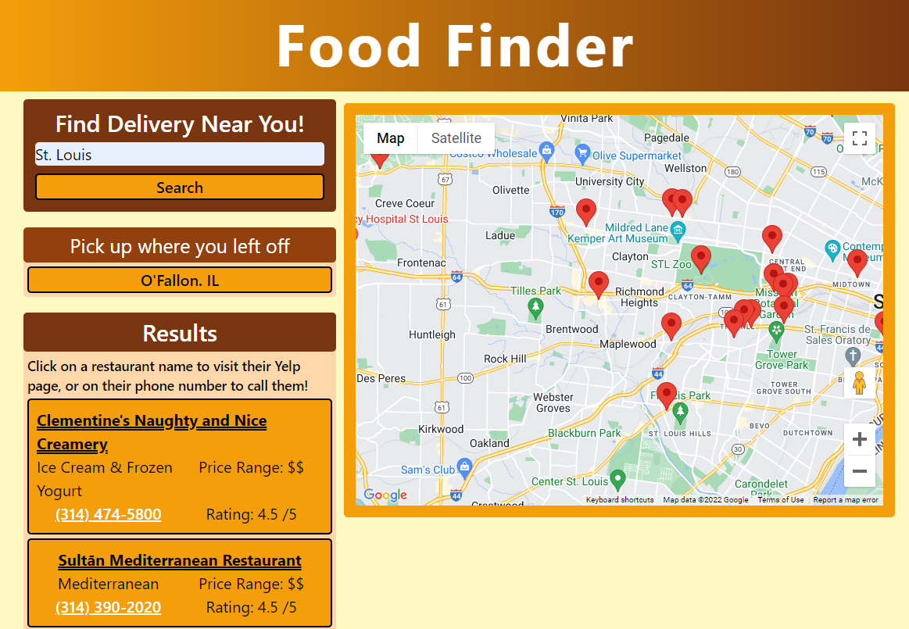

# Food Finder

## Description

Food finder is a simple way to find restaurants that offer delivery near you! The application will display restaurant names, cuisine type, price range, rating, and phone number to find the perfect quick meal solution.

As our first group project, we learned how to use branches to work on multiple issues as a team.

## Usage

First, type your location into the search bar. This can be an address or city. The user's previous search will be saved under "Pick up where you left off" for easy access. Restaurant info will appear in the sidebar and a map with location pins will populate. Clicking on the restaurant name will open a new tab with Yelp reviews. Clicking on a phone number will call the restaurant.

The webpage can be viewed at [https://63857389528963204b4dc037--startling-biscuit-4e7633.netlify.app/](https://63857389528963204b4dc037--startling-biscuit-4e7633.netlify.app/)

## Credits

- [Elliot Baynes](https://github.com/eabaynes)
- [Zana Bolleke](https://github.com/zana-git)
- [Tony Dandino](https://github.com/tdandino1005)
- [Ellie Walsch](https://github.com/EllieWalsch)
